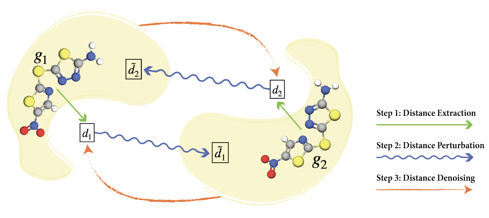

# Molecular Geometry Pretraining with SE(3)-Invariant Denoising Distance Matching

**ICLR 2023**

Authors: Shengchao Liu, Hongyu Guo, Jian Tang

[[Project Page](https://chao1224.github.io/GeoSSL)]
[[OpenReview](https://openreview.net/forum?id=CjTHVo1dvR)]
[[ArXiv](https://arxiv.org/abs/2206.13602)]

This repository provides the source code for the ICLR'23 paper **Molecular Geometry Pretraining with SE(3)-Invariant Denoising Distance Matching**, with the following task:
- This project explores the geometric representation learning on molecules.
- We consider pure geometric information, *i.e.*, the molecule conformation.
- For pretraining, we consider [Molecule3D](https://arxiv.org/abs/2110.01717).
- For fine-tuning (downstream), we consider QM9, MD17, LBA & LEP.

## Environments
```bash
conda create -n Geom3D python=3.7
conda activate Geom3D
conda install -y -c rdkit rdkit
conda install -y numpy networkx scikit-learn
conda install -y -c conda-forge -c pytorch pytorch=1.9.1
conda install -y -c pyg -c conda-forge pyg=2.0.2
pip install ogb==1.2.1

pip install sympy

pip install ase  # for SchNet

pip install atom3d # for Atom3D
pip install cffi # for Atom3D
pip install biopython # for Atom3D

pip intall -e .
```

## Datasets

- For Molecule3D (pretraining) dataset, please run `examples/generate_Molecule3D.py`. The default path is `data/Molecule3D/Molecule3D_1000000`.
- For QM9, it is automatically downloaded in pyg class. The default path is `data/molecule_datasets/qm9`.
- For MD17, it is automatically downloaded in pyg class. The default path is `data/md17`.
- For LBA, please use the following commands:
```
cd data
mkdir -p lba/raw
mkdir -p lba/processed
cd lba/raw

wget http://www.pdbbind.org.cn/download/PDBbind_v2020_refined.tar.gz
tar -xzvf PDBbind_v2020_refined.tar.gz

wget https://zenodo.org/record/4914718/files/LBA-split-by-sequence-identity-30.tar.gz
tar -xzvf LBA-split-by-sequence-identity-30.tar.gz
mv split-by-sequence-identity-30/indices ../processed/
mv split-by-sequence-identity-30/targets ../processed/
```
- For LEP, please use the following commands:
```
cd data
mkdir -p lep/raw
mkdir -p lep/processed
cd lep/raw

wget https://zenodo.org/record/4914734/files/LEP-raw.tar.gz
tar -xzvf LEP-raw.tar.gz
wget https://zenodo.org/record/4914734/files/LEP-split-by-protein.tar.gz
tar -xzvf LEP-split-by-protein.tar.gz
```

## Pretraining

For pretraining, we provide implementations on eight pretraining baselines and our proposed GeoSSL-DDM under the `examples` folder:
- Supervised pretraining in `pretrain_Supervised.py`.
- Type prediction pretraining in `pretrain_ChargePrediction.py`.
- Distance prediction pretraining in `pretrain_DistancePrediction.py`.
- Angle prediction pretraining in `pretrain_TorsionAnglePreddiction.py`.
- 3D InfoGraph pretraining in `pretrain_3DInfoGraph.py`.
- GeoSSL pretraining framework in `pretrain_GeoSSL.py`.
  - GeoSSL-RR pretraining with argument `--GeoSSL_option=RR`.
  - GeoSSL-InfoNCE pretraining with argument `--GeoSSL_option=InfoNCE`.
  - GeoSSL-EBM-NCE pretraining with argument `--GeoSSL_option=EBM-NCE`.
  - GeoSSL-DDM pretraining (ours) with argument `--GeoSSL_option=DDM`.

The running scripts and corresponding hyper-parameters can be found in `scripts/pretrain_baselines` and `scripts/pretrain_GeoSSL_DDM`. 

<p align="center">
   
</p>

## Downstream

The downstream scripts can be found under the `examples` folder:
- `finetune_qm9.py`
- `finetune_md17.py`
- `finetune_lba.py`
- `finetune_lep.py`

The running scripts and corresponding hyper-parameters can be found in `scripts/finetune`. Note that as a fair comparison, we keep a fixed hyper-parameter set for each downstream task, and the only difference is the pretrained checkpoints.

## Checkpoints

We provide both the log files and checkpoints for GeoSSL-DDM [here](https://drive.google.com/file/d/1-m38Puigi3KCk8q8pU7oo40pDoWAUxDm/view?usp=sharing). The log files and checkpoints for other baselines will be released in the next version.

## Cite us

Feel free to cite this work if you find it useful to you!

```
@inproceedings{
    liu2023molecular,
    title={Molecular Geometry Pretraining with {SE}(3)-Invariant Denoising Distance Matching},
    author={Shengchao Liu and Hongyu Guo and Jian Tang},
    booktitle={The Eleventh International Conference on Learning Representations},
    year={2023},
    url={https://openreview.net/forum?id=CjTHVo1dvR}
}
```
